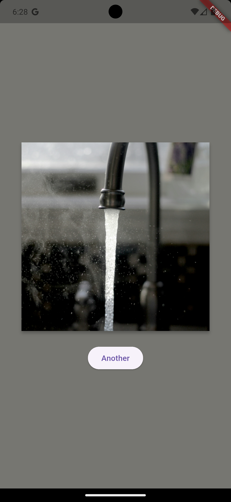
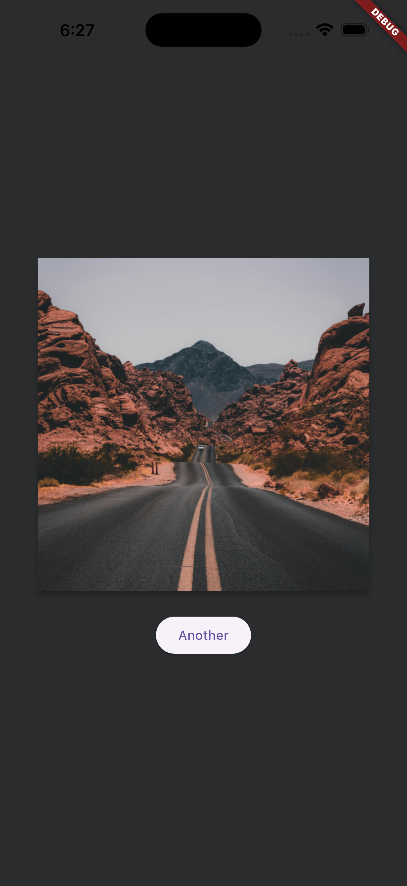
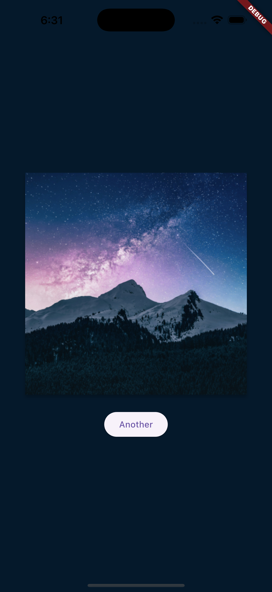

# Random Image

The main goal of this project is to display a random image from the internet, pick a dominant
color from the image and use that color to style the user interface background color. The project
tries to approach this goal using a simplified architecture, minimal dependencies and reduced
complexity. Because of this, certain trade-offs were made, viz:

- The app uses `Cubit` (with `freezed`) over `Bloc` for state management to reduce boilerplate
- The app does not use `get_it` for dependency injection. Dependencies are scoped to where they
  are needed using `RepositoryProvider`s and `BlocProvider`s
- The app does not use any routing libraries. It does not need one since it only has a single
  screen
- The app uses `http` over `dio` for network calls
- The app does not use `json_annotation`/`json_serializable` for parsing JSON. The API response
  is simple enough to parse manually
- Application strings are hardcoded and not localized

## Video Demo

## Screenshots

<p>
  
  
  
</p>

## Important To Note

###### Dominant Color Detection Implementation

Dominant color detection is done using the `palette_generator` package

###### Jank Due To Dominant Color Computation

The process of computing the dominant color can be resource-intensive, especially for large images.
To ensure smooth performance, the dominant color is calculated asynchronously in a separate
isolate. This prevents blocking the main UI thread and keeps the app responsive

###### Performance Of Dominant Color Computation Even In Isolates

While using isolates helps improve performance, the dominant color computation can still be slow
for very large images. To mitigate this, the image is resized to a smaller dimension before
processing, which speeds up the computation without significantly affecting the accuracy of the
dominant color detection

## Architecture And Project Structure

The project follows a simplified version of Clean Architecture. Data flows from the data layer
to the presentation layer. Each layer has a specific responsibility, ensuring separation of
concerns and maintainability:

- **Data Layer**: Responsible for fetching data from the API and processing it. It includes
  models to represent the data and repositories to handle business logic and data manipulation
- **Presentation Layer**: Manages the user interface and state management. It includes screens
  for displaying the UI, widgets for reusable components, and cubits for managing state

The project is structured as follows:

```lib/
├── data/
│   ├── models/               # Data models from API responses
│   ├── repositories/         # Business logic and data handling
├── presentation/
│   ├── cubits/               # State management using Cubit
│   ├── screens/              # UI screens
│   ├── widgets/              # Reusable UI components
├── app.dart                  # Application setup and configuration
├── main.dart                 # Entry point of the application
```

## Testing

The project includes some unit tests for the cubit and repository layers. You can find the test
files in the `test/` directory, mirroring the structure of the `lib/` directory. Test coverage is
currently at 51.6%. To run the tests, use the following command:

```bash
flutter test
```

You can also generate a coverage report using:

```bash
flutter test --coverage
```

This command will create a `coverage/lcov.info` file that you can use with coverage tools to
visualize the coverage data. For example, using the `lcov` tool, you can generate HTML coverage
reports like so:

```bash
genhtml coverage/lcov.info -o coverage/html_report
```

Then, open the `coverage/html_report/index.html` file in your web browser to view the coverage
report

## Getting Started

To run the project locally, follow these steps:

1. Ensure you have Flutter installed. You can follow the
   instructions [here](https://flutter.dev/docs/get-started/install)
2. Clone this repository:
   ```bash
   git clone
   ```
3. Navigate to the project directory:
   ```bash
   cd random_image
   ```
4. Install dependencies:
   ```bash
   flutter pub get
   ```
5. Run the app:
   ```bash
   flutter run
   ```
   